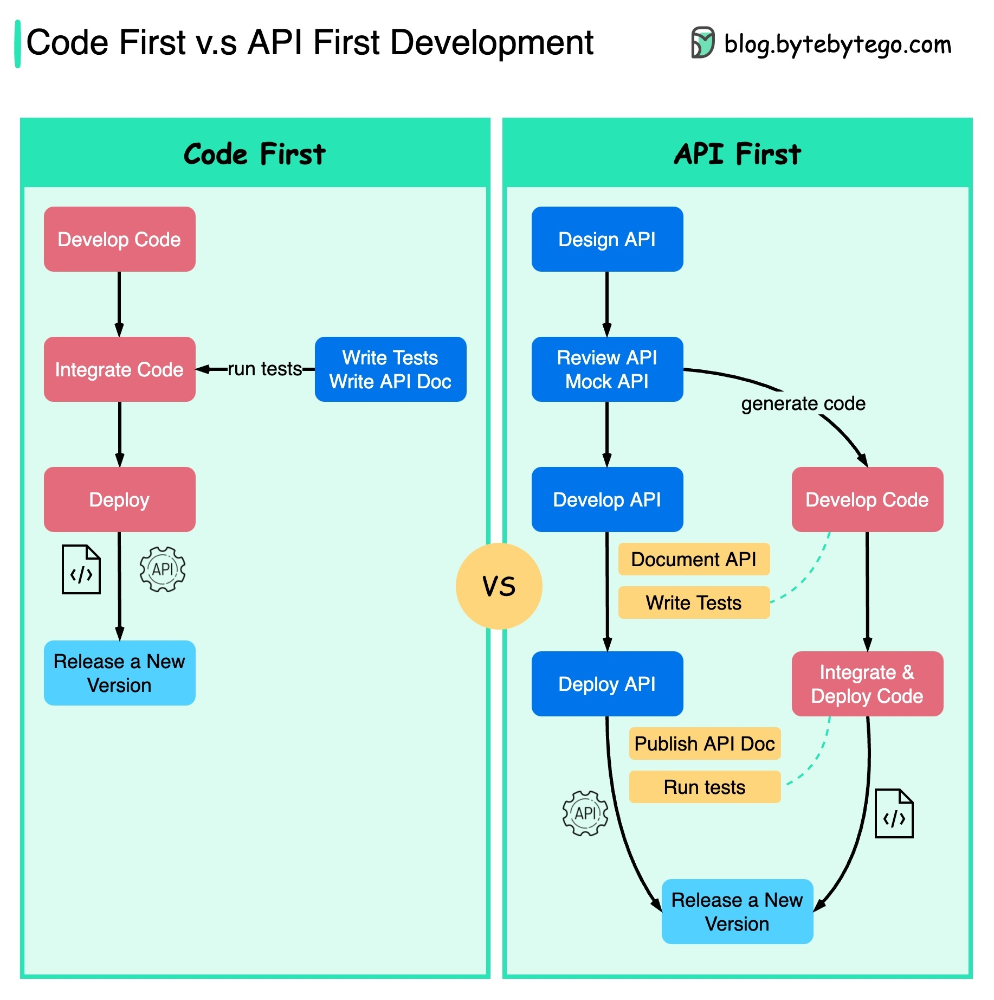

# API First подход + OpenAPI 3.0

## Про процесс API First:

Этот подход предлагает начинать разработку проекта с проектирования и создания контракта (API) между клиентом и сервером.

Проектирование **API** происходит в виде специального **openapi** файла, по которому можно сгенерировать как серверную часть с моделью данных, так и клиентскую
часть (Клиент + моделька).

Нам не важно на каком языке пишется бэк или клиент, генератор поддердивает много популярных языков и библиотек. Есть генераторы для сервера и генераторы для клиента

https://openapi-generator.tech/docs/generators/



## Про процесс детальнее:

### **Overview**

1. Команда создает контракт (openapi.yml, openapi.json) и делится им с участниками процесса (Фронт-бэк, Бэк-Бэк) для обратной связи и итеративных изменений.

2. Когда команда и заинтересованные стороны соглашаются по поводу дизайна **API**, разработчик использует документ для генерации каркаса серверной/клиентской
   части кода с помощью инструмента для генерации документации.

3. Наконец, разработчик приступает к работе над бизнес-логикой API, используя предварительно сгенерированный код.

### **Плюсы**:

1. **Параллельная разработка:** API-first подразумевает установку контракта. Создание контракта между службами, который соблюдают команды по всей организации, позволяет этим командам работать над несколькими API одновременно. Разработчикам не нужно ждать выпуска обновлений API перед переходом к следующему. Команды могут создавать mock API и тестировать зависимости от API на основе установленного определения API (Spring Cloud Contract).

2. **Снижение затрат:** Возможность повторного использования API и кода. Решение проблем на этапе проектирования API

3. **Быстрый выход на рынок:** Инструменты автоматизации (в т.ч. SwaggerHub), облегчают импорт файлов с описанием API, ускоряя процесс разработки API и
   приложений.

4. **Положительный опыт разработчика:** Хорошо спроектированные, документированные и последовательные API улучшают опыт разработчиков, облегчая повторное
   использование кода, обучение новых членов команды

5. **Смягчение рисков:** API играют ключевую роль в различных бизнес-процессах, и подход API-first снижает риск фейла, обеспечивая надежность,
   последовательность и удобство использования для разработчиков

6. https://swagger.io/resources/articles/adopting-an-api-first-approach/

### **Минусы**

1. Требуется super-skilled аналитик

2. Требуются грамотно подготовленные спецификации

3. Пересмотр / Подготовка инфраструктуры

4. Технические ограничения генераторов (Реактивность, мок. данные из под ката)

## **Про openapi файл**

### Как выглядит open api файл?

https://editor-next.swagger.io/ - Тут можно найти много примеров описания файла, File -> Load Example 

### Основные сущности в файле openapi.yml

OpenAPI (OpenAPI Specification) - это набор правил, описывающих структуру и формат файла, который описывает RESTful API. Файл обычно имеет формат YAML (.yml) или JSON (.json). Вот основные сущности, которые можно найти в файле OpenAPI в формате YAML:

###### openapi:

Версия OpenAPI Specification, указывающая на используемую версию стандарта.

```yml
openapi: 3.0.0
```

###### info

Информация о API, такая как название, версия и описание.

```yml
info:
  title: My API
  version: 1.0.0
  description: Description of my API.
```

###### servers:

Описание серверов, на которых развёрнуто API (Зависит от стендов)

```yml
servers:
  - url: https://api.example.com/v1
```

###### paths:

Описания конечных точек (endpoints) API и методов, поддерживаемых каждой конечной точкой.

```yml
paths:
  /users:
    get:
      summary: Get a list of users
      responses:
        '200':
          description: Successful response
```

###### components:

Переиспользуемые компоненты, такие как схемы данных, параметры запросов и ответов.

```yml
components:
  schemas:
    User:
      type: object
      properties:
        id:
          type: integer
        name:
          type: string
  parameters:
    userId:
      name: id
      in: path
      description: User ID
      required: true
      schema:
        type: integer
```

###### security:

Описывает методы аутентификации и авторизации.

```yml
security:
  - apiKey: [ ]
```

###### tags:

Группирует конечные точки (endpoints) по тегам для лучшей организации.

```yml
tags:
  - name: users
    description: Operations related to users
```

###### externalDocs:

Ссылка на внешние документы для дополнительной информации.

```yml
externalDocs:
  description: Find more info here
  url: https://docs.example.com
```

Эти основные сущности обеспечивают структуру и описание API в файле OpenAPI.

### Cекция `parameters` в разделе `components`

###### **Path Parameters (Параметры пути):**

```yml
parameters:
  - name: userId
    in: path
    description: ID of the user
    required: true
    schema:
      type: integer
```

- `in`: Указывает, где параметр будет передаваться. В данном случае, `path` означает, что это параметр пути.
- `name`: Название параметра.
- `description`: Описание параметра.
- `required`: Указывает, является ли параметр обязательным.

###### **Query Parameters (Параметры запроса):**

```yml
parameters:
  - name: page
    in: query
    description: Page number
    required: false
    schema:
      type: integer
```

- `in`: В данном случае, `query` указывает, что это параметр запроса.
- `name`: Название параметра.
- `description`: Описание параметра.
- `required`: Указывает, является ли параметр обязательным.

###### **Header Parameters (Параметры заголовка):**

```yml
parameters:
  - name: Authorization
    in: header
    description: Access token
    required: true
    schema:
      type: string
```

- `in`: В данном случае, `header` указывает, что это параметр заголовка.
- `name`: Название параметра.
- `description`: Описание параметра.
- `required`: Указывает, является ли параметр обязательным.

###### **Request Body Parameters (Параметры тела запроса):**

```yml
parameters:
  - name: user
    in: body
    description: User object
    required: true
    schema:
      $ref: '#/components/schemas/User'
```

- `in`: В данном случае, `body` указывает, что это параметр тела запроса.
- `name`: Название параметра.
- `description`: Описание параметра.
- `required`: Указывает, является ли параметр обязательным.
- `schema`: Схема данных, описывающая структуру параметра тела запроса.

## Про применение в проекте

1. [GitHub - Akvilona/account-service](https://github.com/Akvilona/account-service)

2. [GitHub - Akvilona/fraud-service](https://github.com/Akvilona/fraud-service)

3. https://git.sklianki.ru/projects/MKP/repos/mkp-callcenter-api/browse

## Про генерацию open api файла

1. http://localhost:8080/v3/api-docs
2. swagger-cli bundle openapi.json -o merged.json

## **Про что почитать и куда покопать**

1. Пример использования api first в springboot [API First Development with Spring Boot and OpenAPI 3.0 | Baeldung](https://www.baeldung.com/spring-boot-openapi-api-first-development)

2. OpenAPI/Swagger для начинающих https://habr.com/p/776538/

3. Переводим документацию API из Markdown в OpenAPI [Переводим документацию API из Markdown в OpenAPI / Хабр](https://habr.com/ru/companies/hh/articles/777750/)

4. Так же есть возможность применения API First для Асинхронного взаимодействия!
   
   1.  https://habr.com/p/768012/Интересно
   
   2. https://www.asyncapi.com/docs/tutorials/getting-started/hello-world

5. [OpenAPI станет проще: готовится версия 4.0 / Хабр](https://habr.com/ru/companies/ruvds/articles/779788/)
